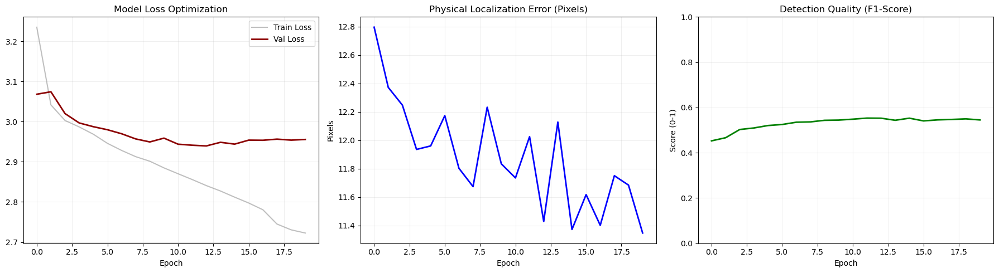
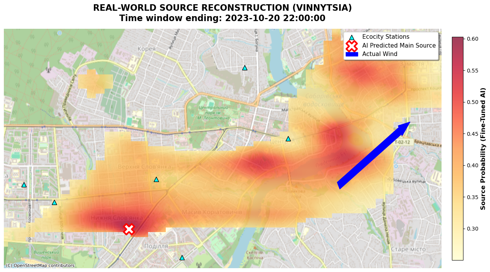
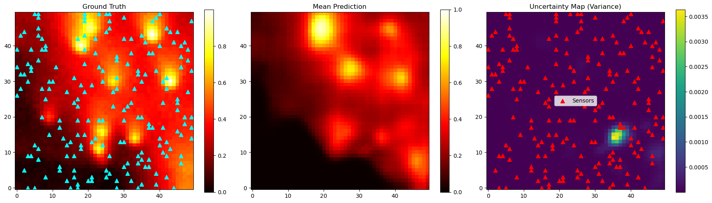
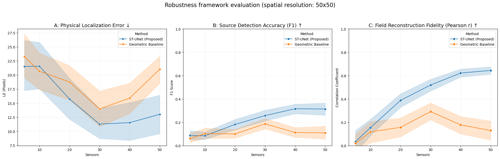

# Spatio-Temporal Deep Learning for Air Pollution Source Localization from Sparse Sensor Networks

[](https://www.python.org/downloads/)
[](https://pytorch.org/)
[](https://opensource.org/licenses/MIT)

## 1. Abstract
This repository contains the official implementation of the **ST-UNet (Spatio-Temporal U-Net)** framework for solving the inverse problem of air pollution source localization. In urban environments, identifying emission epicenters is often hampered by extreme data sparsity from low-cost sensor networks (LCSN). Our approach integrates physical advection-diffusion modeling with deep learning to reconstruct high-resolution emission maps from sparse, noisy observations.

---

## 2. Key Novelty
We introduced a **Gaussian Smearing Layer** to act as a bridge between sparse sensor data and the model's grid. This layer is differentiable, which helps the neural network learn from scattered data points more effectively. 

To make the model understand real-world conditions, we use **Physics-Aware Encoding**. This method integrates wind data and spatial coordinates directly into the model’s internal processing. 

We also developed a **Hybrid Inverse Loss** function. This special mathematical formula helps the AI find small pollution sources even when they occupy a very small part of the map. 

Finally, we implemented **Uncertainty Quantification** using Monte Carlo Dropout. This tool generates variance maps that show how confident the AI is in its predictions, helping users make better decisions.

---

## 3. Repository Structure
*   `src/`: Core Python modules.
    *   `pollution_sim.py`: Physical environment simulator, emission managers, and sensor network modeling.
    *   `source_locator.py`: ST-UNet architecture, Hybrid Loss implementation, and training/inference engine.
*   `notebooks/`: Jupyter notebooks for research demonstration, data analysis, and visualization.
*   `assets/`: Stores result images and figures used in this documentation.
*   `requirements.txt`: List of required Python packages for environment reproducibility.

---

## 4. Installation & Setup

### Prerequisites
*   Python 3.8 or higher
*   CUDA-capable GPU (recommended for training)

### Installation
```bash
# Clone the repository
git clone https://github.com/KyryloVadurin/ST-UNet-Pollution-Localization.git
cd ST-UNet-Pollution-Localization

# Install required dependencies
pip install -r requirements.txt
```

---

## 5. Methodology & Results

### Training Dynamics
The model demonstrates stable convergence across reconstruction and localization metrics.


### Real-World Application (Vinnytsia Case Study)
The model was validated using PM2.5 data from the **EcoCity** network. By projecting AI outputs onto OpenStreetMap, we pinpointed sources with high geographic precision.


### Uncertainty Assessment
Predictive variance maps allow decision-makers to identify areas where additional sensor deployment is necessary.


---

## 6. Performance & Robustness
We evaluated the ST-UNet against classical geometric baselines. Our model maintains superior accuracy even as the sensor network density decreases significantly.


---

## 7. Citation
If you find this work useful for your research, please cite:

```bibtex
@article{vadurin2024st-unet,
  title={Spatio-Temporal Deep Learning for Air Pollution Source Localization from Sparse Sensor Networks},
  author={Vadurin, Kyrylo},
  journal={Official Research Repository},
  year={2024},
  url={https://github.com/KyryloVadurin/ST-UNet-Pollution-Localization}
}
```

---

## 8. License
This project is licensed under the Apache License - see the [LICENSE](LICENSE) file for details.
